The resume domain models a structured, localized CV as a root aggregate with composable sections for identity, experience, education, credentials, skills, projects, and supporting metadata. It is designed to support rich presentation while reusing shared CMS entities such as `Image`, `Language`, and `Certification`. 

## Purpose and scope

The `Resume` domain represents a complete résumé/CV document. It serves as the aggregate root for all CV-specific content and provides a single composition point for:

- Personal and contact information
- Professional work history and highlights
- Volunteer experience
- Education and awards
- Certifications and publications
- Skills and language proficiency
- Interests, references, and projects
- Localized content and media assets
- Creation and update timestamps

The schema separates repeatable concepts into dedicated entities rather than embedding them as JSON or string arrays. This supports independent editing, relation-based querying, media reuse, and content localization. 

## Aggregate overview

`Resume` is the central composition entity. It owns the document-level title and uses relationships to organize individual CV sections.

| Field | Type | Cardinality | Domain purpose |
|---|---|---:|---|
| `id` | `ID` | One | Unique identifier |
| `title` | `String` | One | Human-readable resume title; usable as a unique lookup key |
| `basicInformation` | `ResumeBasicInformation` | One | Header identity, contact details, location, profile links, and summary |
| `work` | `ResumeWork` | Many | Professional employment history |
| `volunteer` | `ResumeVolunteer` | Many | Volunteer roles and community work |
| `education` | `ResumeEducation` | Many | Academic and training records |
| `awards` | `ResumeAward` | Many | Awards, recognitions, and distinctions |
| `certificates` | `Certification` | Many | Reusable certification records |
| `publications` | `ResumePublication` | Many | Published work |
| `skills` | `ResumeSkill` | Many | Skill groups and keyword-based competencies |
| `resumeLanguages` | `ResumeLanguage` | Many | Spoken or written language proficiency |
| `interests` | `ResumeInterest` | Many | Interests and associated keywords |
| `references` | `ResumeReference` | Many | Professional references |
| `projects` | `ResumeProject` | Many | Portfolio projects and notable engagements |
| `language` | `Language` | One | Content/UI locale for the resume |
| `createdAt` | `DateTime` | One | Record creation time |
| `updatedAt` | `DateTime` | One | Most recent modification time |

All collection relationships expose corresponding count fields—such as `workCount`, `skillsCount`, and `projectsCount`—for lightweight list or summary views without loading the underlying records. 

## Domain model

```mermaid
flowchart TB
    Resume["Resume<br/>Aggregate Root"]

    Basic["ResumeBasicInformation"]
    Work["ResumeWork"]
    Volunteer["ResumeVolunteer"]
    Education["ResumeEducation"]
    Award["ResumeAward"]
    Certification["Certification"]
    Publication["ResumePublication"]
    Skill["ResumeSkill"]
    ResumeLanguage["ResumeLanguage"]
    Interest["ResumeInterest"]
    Reference["ResumeReference"]
    Project["ResumeProject"]
    Language["Language"]

    Resume -->|"basicInformation · 1"| Basic
    Resume -->|"work · 0..*"| Work
    Resume -->|"volunteer · 0..*"| Volunteer
    Resume -->|"education · 0..*"| Education
    Resume -->|"awards · 0..*"| Award
    Resume -->|"certificates · 0..*"| Certification
    Resume -->|"publications · 0..*"| Publication
    Resume -->|"skills · 0..*"| Skill
    Resume -->|"resumeLanguages · 0..*"| ResumeLanguage
    Resume -->|"interests · 0..*"| Interest
    Resume -->|"references · 0..*"| Reference
    Resume -->|"projects · 0..*"| Project
    Resume -->|"language · 0..1"| Language

    Basic -->|"image · 0..1"| Image["Image"]
    Basic -->|"location · 0..1"| Location["ResumeLocation"]
    Basic -->|"profiles · 0..*"| Profile["ResumeProfile"]
    Basic -->|"language · 0..1"| Language

    Work -->|"highlights · 0..*"| Highlight["ResumeHighlight"]
    Work -->|"image · 0..1"| Image
    Work -->|"language · 0..1"| Language

    Volunteer -->|"language · 0..1"| Language
    Education -->|"language · 0..1"| Language
    Award -->|"language · 0..1"| Language
    Certification -->|"image · 0..1"| Image
    Certification -->|"language · 0..1"| Language
    Publication -->|"language · 0..1"| Language
    Skill -->|"language · 0..1"| Language
    ResumeLanguage -->|"uiLanguage · 0..1"| Language
    Interest -->|"language · 0..1"| Language
    Reference -->|"language · 0..1"| Language
    Project -->|"image · 0..1"| Image
    Project -->|"language · 0..1"| Language

    Location -->|"language · 0..1"| Language
    Profile -->|"language · 0..1"| Language
    Image -->|"type · 0..1"| Type["Type"]

    classDef root fill:#1d4ed8,color:#fff,stroke:#1e3a8a,stroke-width:2px
    classDef domain fill:#dbeafe,stroke:#2563eb,color:#111827
    classDef shared fill:#f3f4f6,stroke:#6b7280,color:#111827

    class Resume root
    class Basic,Work,Volunteer,Education,Award,Publication,Skill,ResumeLanguage,Interest,Reference,Project,Highlight,Location,Profile domain
    class Certification,Image,Language,Type shared
```

The diagram focuses on forward ownership/composition relationships. Child types also expose reverse `resume` links back to `Resume`, and `ResumeHighlight` exposes a reverse `work` link to `ResumeWork`; these are navigation relationships rather than additional aggregate branches. 

## Entity responsibilities

### Resume identity and contact

`ResumeBasicInformation` defines the résumé header and primary personal identity.

| Field group | Fields | Description |
|---|---|---|
| Identity | `name`, `label` | Candidate name and professional headline or role label |
| Contact | `email`, `phone`, `url` | Primary communication and personal-site details |
| Summary | `summary` | Professional profile or executive summary |
| Presentation | `image` | Optional profile or avatar image |
| Address | `location` | Structured geographic/contact location |
| Profiles | `profiles` | Repeating social or professional-network presence |
| Localization | `language` | Locale used for this content |

`ResumeLocation` holds `address`, `postalCode`, `city`, `countryCode`, and `region`, keeping address data structured rather than embedding it in the profile summary. `ResumeProfile` represents an external profile with `network`, `username`, and `url`. Both entities support their own `Language` relationship. 

### Work history

`ResumeWork` represents a professional role at an organization.

| Field group | Fields | Description |
|---|---|---|
| Employer and role | `name`, `position`, `url` | Organization, job title, and optional company link |
| Period | `startDate`, `endDate` | Employment date range; `endDate` can be absent for current positions |
| Narrative | `summary` | Role overview, responsibilities, or business impact |
| Highlights | `highlights` | Structured list of accomplishment statements |
| Presentation | `image` | Optional employer or role image |
| Localization | `language` | Locale for the entry |

Each `ResumeWork` entry has zero or more `ResumeHighlight` children. A highlight contains a `value` field and links back to its parent work record through `work`. This lets a UI render achievements as individually ordered or editable bullet points rather than parsing a serialized list. 

### Experience and qualifications

The domain separates experience and qualifications into targeted record types:

| Entity | Purpose | Key fields |
|---|---|---|
| `ResumeVolunteer` | Volunteer or unpaid roles | `organization`, `position`, `url`, `startDate`, `endDate`, `summary`, `highlights` |
| `ResumeEducation` | Degree, course, or formal education records | `institution`, `url`, `area`, `studyType`, `startDate`, `endDate`, `score`, `courses` |
| `ResumeAward` | Awards and recognition | `title`, `date`, `awarder`, `summary`, `url` |
| `Certification` | Certification credential shared with the wider CMS | `title`, `description`, `image`, `link` |
| `ResumePublication` | Written or published work | `name`, `publisher`, `releaseDate`, `url`, `summary` |

With the exception of work highlights, these sections use flat records. For example, volunteer `highlights`, education `courses`, skill `keywords`, project `highlights`, and interest `keywords` are stored as `String` fields rather than separate child entities. Consumers must therefore establish and consistently apply a representation convention—commonly newline-separated values, comma-separated values, or JSON-encoded content—if multiple values are expected. 

### Competencies and portfolio

`ResumeSkill` models a competency category or skill area:

- `name`: the primary skill or category name
- `level`: an optional proficiency level
- `keywords`: supporting technologies, tools, or subskills
- `language`: localization metadata

`ResumeLanguage` models the candidate’s actual spoken/written languages:

- `language`: language name as text, such as “German” or “English”
- `fluency`: optional proficiency descriptor
- `uiLanguage`: relationship to the shared `Language` entity used to localize the entry

The distinct `uiLanguage` name prevents confusion between a candidate’s language capability and the locale used to render the record.

`ResumeProject` models portfolio projects or key engagements. It contains `name`, optional date range, `description`, `highlights`, `url`, an optional `image`, and localization through `language`. 

### Supplemental content

`ResumeInterest` captures a named interest and associated keywords. `ResumeReference` captures a contact or reference name plus a freeform `reference` value. Both are localized and belong to a single `Resume`. 

## Shared entities and localization

The resume domain relies on shared entities to prevent duplication across CMS content areas.

| Shared entity | Resume usage | Domain role |
|---|---|---|
| `Language` | Linked from `Resume` and most resume child records | Localizes content records through `label` and `value` |
| `Image` | Used by basic information, work entries, certifications, and projects | Stores `src`, `alt`, dimensions, `fill`, and an optional `type` |
| `Type` | Linked from `Image` | Classifies an image or media record |
| `Certification` | Linked through `Resume.certificates` | Reusable credential entity also suitable for non-resume CMS sections |

The root `Resume.language` establishes the intended document locale. Child-level language relationships allow selective override or separate localized versions of individual records. A consumer should normally query the root resume and its child content for a matching locale; where a child locale is absent, it may apply a documented fallback strategy to the root locale. The schema itself exposes no mandatory-field or fallback constraint for this behavior. 

## Ownership and lifecycle

The model expresses two lifecycle patterns:

1. **Resume-owned domain entries**  
   `ResumeWork`, `ResumeVolunteer`, `ResumeEducation`, `ResumeAward`, `ResumePublication`, `ResumeSkill`, `ResumeLanguage`, `ResumeInterest`, `ResumeReference`, and `ResumeProject` each include a reverse `resume: Resume` relationship. They are conceptually owned by one résumé even though Keystone permits them to be created, connected, disconnected, or managed individually through relation inputs. 

2. **Shared/reusable content**  
   `Certification`, `Image`, `Language`, and `Type` are broader shared entities. Their presence in the resume domain should not imply exclusive ownership or automatic deletion when a resume is removed. In particular, `Certification` is also used by `CertificationSection`, and `Image` is used throughout the wider content schema. 

## API and query behavior

The generated GraphQL API exposes both read and mutation capabilities for the aggregate and its related objects.

### Read behavior

`Resume` supports lookup by:

- `id`
- `title`
- `basicInformation`

Collection fields support standard Keystone list arguments:

- `where`
- `orderBy`
- `take`
- `skip`
- `cursor`

For example, a resume consumer can query only the most recent work entries, order records by `startDate`, or return summary counts without fetching all section details. 

### Mutation behavior

The creation and update inputs support nested relation operations:

| Relation type | Create support | Update support |
|---|---|---|
| To-one | `create`, `connect` | `create`, `connect`, `disconnect` |
| To-many | `create`, `connect` | `create`, `connect`, `disconnect`, `set` |

This supports a document-editing workflow in which a client can create a résumé with embedded work, education, skills, and project records, or later connect already-existing records. The `set` operation on to-many relations should be used carefully because it replaces the current relation set rather than incrementally adding entries. 

## Documentation notes

- The schema does not include explicit ordering fields—such as `sortOrder` or `displayOrder`—on résumé section entries. Rendering order must therefore be supplied by query ordering where a reliable domain field exists, such as `startDate`, or by adding an explicit order field if manual sequence control is required.
- Most relationship fields are nullable in the GraphQL output. Application-level validation should determine which sections are required for a publishable resume—for example, `basicInformation`, a locale, and at least one work or project entry.
- `title` is available as a unique lookup input, making it a plausible stable identifier or slug-like document key. If titles may change, client integrations should retain the immutable `id` as their primary identifier.
- `createdAt` and `updatedAt` belong only to the root `Resume` object in the displayed resume domain. Individual child entity types do not expose their own timestamps in this schema.
- The data model stores several multi-value concepts as strings. A project should define serialization and validation rules before integrating editing interfaces or export pipelines.
